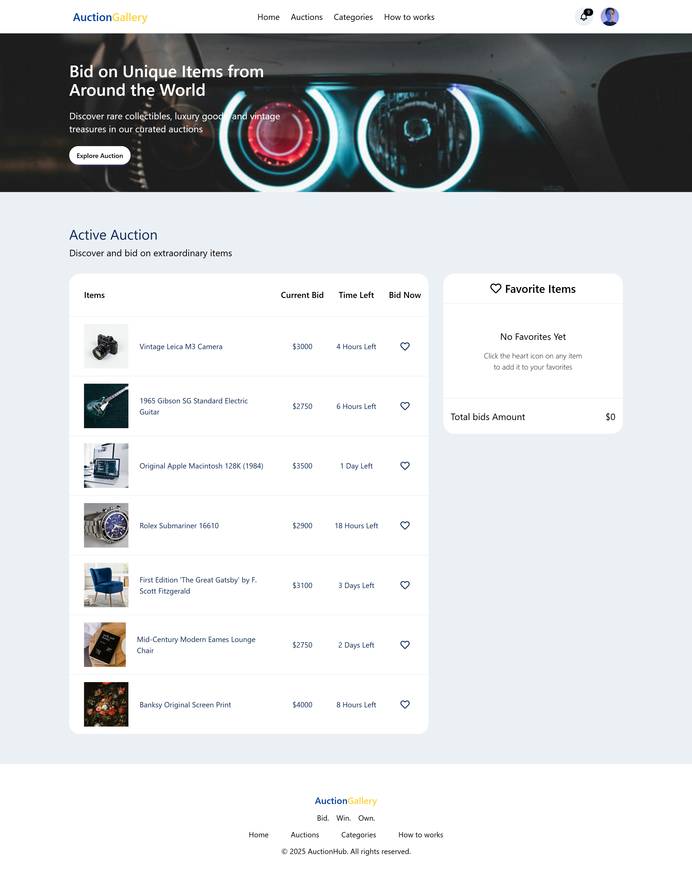

# Auction Gallery

## Overview

Auction Gallery is a React-based project designed for practicing and showcasing fundamental web development skills. The application combines **React**, **HTML**, **Tailwind CSS**, **Daisy UI**, and **JavaScript**. It provides users with an interactive auction gallery experience, featuring functionalities like active auctions, favorite items, toast notifications, and a visually appealing footer—all designed to match a given Figma design.

## Key Features

1. **Dynamic Banner Design**: The banner section mirrors the design provided in Figma, ensuring a seamless and polished visual experience.
2. **Interactive Auction Listings**:
   - Displays six active items with their images, names, bid prices, remaining time, and an interactive "Bid Now" button.
3. **Favorites Section**:
   - Items can be added to favorites using a ❤️ button.
   - Shows item details such as name, current bid price, and bids count.
   - Includes ❌ button to remove items from favorites and adjusts the total price accordingly.
   - Initially displays a “No items” message with a total amount of `0`.
4. **Responsive Toast Notifications**: React-Toastify displays notifications when an item is added to favorites, enhancing user interaction.
5. **Item Data Table**: Auction items are listed neatly in a table format for clear data visualization.
6. **Disabled ❤️ Button**: After clicking the ❤️ button:
   - The button is disabled.
   - Cursor changes to `not-allowed`.
   - Button color changes to red.
7. **Favorites Management**:
   - Removing items from favorites updates the total amount instantly.
   - Simplifies item management for the user.
8. **Detailed Footer**: The footer replicates the exact design from Figma for consistency.

## Technologies Used

- **React**
- **HTML**
- **Tailwind CSS**
- **Daisy UI**
- **JavaScript**
- **React-Toastify**

## Installation

1. Clone the repository:
   ```bash
   git clone https://github.com/Erfan-Khan-Dhrubo/project-7-Web-development.git
   ```

## Live Demo:

Check out the live version of the Auction Gallery here: <a href="http://project-7-web-development.surge.sh" target="_blank">http://project-7-web-development.surge.sh</a>

## A visual representation of my page.


